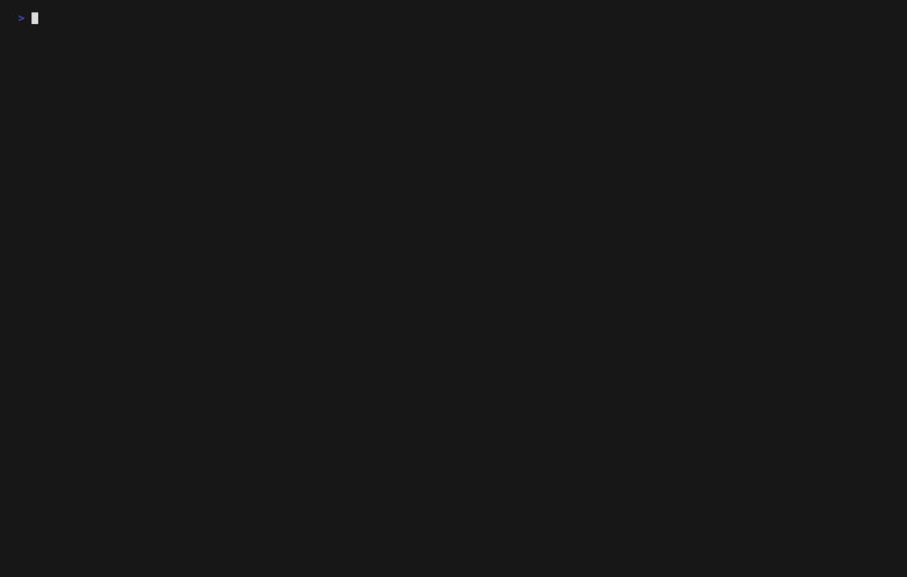
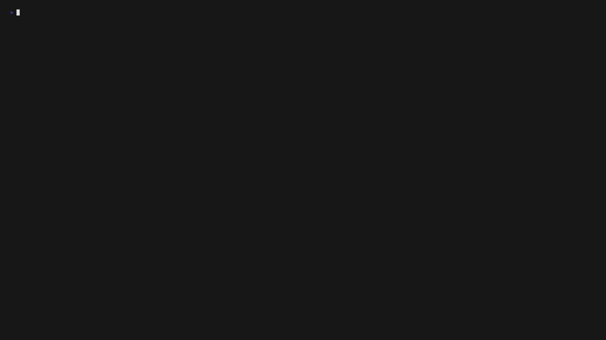
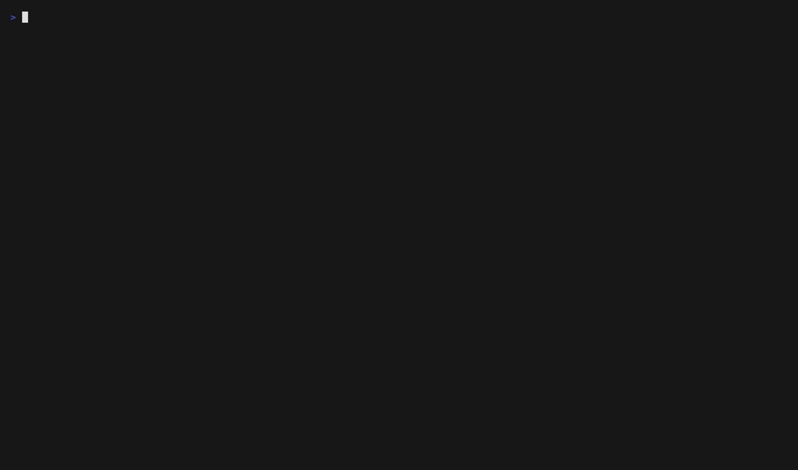

<div align="center">

# 🐦 Tuiuiu

### Terminal UI Framework for the Modern Era

Build beautiful, reactive terminal apps with a Modern Component API.
<br>
**Zero dependencies** • **Signals-based** • **Flexbox layout** • **Full mouse support** • **MCP Ready**
<br>
50+ components. Pure Node.js. No C++ bindings. AI-powered development.

[](https://www.npmjs.com/package/tuiuiu.js)
[](https://www.npmjs.com/package/tuiuiu.js)
[](https://www.typescriptlang.org/)
[](https://nodejs.org/)
[](https://github.com/forattini-dev/tuiuiu.js/blob/main/LICENSE)
[](https://www.npmjs.com/package/tuiuiu.js)

[📖 Documentation](https://forattini-dev.github.io/tuiuiu.js) · [🚀 Quick Start](#quick-start) · [🎨 Storybook](#storybook) · [🤖 MCP Server](#mcp-server)


</div>

---

## Quick Start

```bash
npm install tuiuiu.js
```

```typescript
import { render, Box, Text, useState, useInput, useApp } from 'tuiuiu.js';

function Counter() {
  const [count, setCount] = useState(0);
  const { exit } = useApp();

  useInput((char, key) => {
    if (key.upArrow) setCount(c => c + 1);
    if (key.downArrow) setCount(c => c - 1);
    if (key.escape) exit();
  });

  return Box({ flexDirection: 'column', padding: 1, borderStyle: 'round' },
    Text({ color: 'cyan', bold: true }, '🐦 Tuiuiu Counter'),
    Text({ color: 'yellow', marginTop: 1 }, `Count: ${count()}`),
    Text({ color: 'gray', dim: true }, '↑/↓: change • Esc: exit')
  );
}

const { waitUntilExit } = render(Counter);
await waitUntilExit();
```

## What's Inside

| Category | Features |
|:---------|:---------|
| **Core** | Signal-based reactivity, Flexbox layout engine, Focus management, Event system |
| **Primitives** | Box, Text, Spacer, Newline, Fragment, Divider, Canvas |
| **Atoms** | Button, TextInput, Switch, Slider, Spinner, ProgressBar, Timer, Tooltip |
| **Molecules** | Select, MultiSelect, RadioGroup, Autocomplete, Table, Tabs, Tree, Calendar, CodeBlock, Markdown |
| **Organisms** | Modal, CommandPalette, DataTable, FileManager, SplitPanel, ScrollArea, Grid, OverlayStack |
| **Templates** | AppShell, Page, Header, StatusBar, VStack, HStack, Center, FullScreen |
| **Data Viz** | BarChart, LineChart, Sparkline, Heatmap, Gauge, BigText, Digits |
| **DevTools** | Layout Inspector, Event Logger, Performance Metrics, Component Storybook |

## Real-World Examples

Build terminal apps that feel native. These examples recreate familiar CLI tools entirely in Tuiuiu:

<table>
<tr>
<td align="center" width="33%">
<strong>📊 htop</strong><br>
<em>Process Monitor</em><br>

</td>
<td align="center" width="33%">
<strong>🌐 mtr</strong><br>
<em>Network Diagnostics</em><br>

</td>
<td align="center" width="33%">
<strong>📡 ping</strong><br>
<em>Network Latency</em><br>

</td>
</tr>
</table>

```bash
# Try them yourself
pnpm tsx examples/app-htop.ts   # Process monitor with live updates
pnpm tsx examples/app-mtr.ts    # Network route tracer
pnpm tsx examples/app-ping.ts   # Network latency monitor
```

## Gallery

<table>
<tr>
<td align="center" width="50%">
<strong>📊 Real-time Dashboard</strong><br>

</td>
<td align="center" width="50%">
<strong>💬 Chat Application</strong><br>

</td>
</tr>
<tr>
<td align="center">
<strong>🎨 Component Storybook</strong><br>

</td>
<td align="center">
<strong>📝 Interactive Forms</strong><br>

</td>
</tr>
</table>

## Highlights

### ⚡ Signal-based Reactivity

Fine-grained reactivity without Virtual DOM overhead. Only what changes gets updated.

```typescript
import { createSignal, createEffect } from 'tuiuiu.js';

const [count, setCount] = createSignal(0);
const doubled = () => count() * 2;

createEffect(() => console.log(`Count: ${count()}, Doubled: ${doubled()}`));

setCount(5); // → "Count: 5, Doubled: 10"
```

### 📦 Flexbox Layout

Build complex layouts with the CSS Flexbox model you already know.

```typescript
Box({
  flexDirection: 'row',
  justifyContent: 'space-between',
  alignItems: 'center',
  gap: 2,
  padding: 1
},
  Text({ color: 'blue' }, 'Left'),
  Box({ flexGrow: 1 }),
  Text({ color: 'red' }, 'Right')
)
```

### 🎨 50+ Ready-to-Use Components

From simple buttons to complex data tables, everything is included.

```typescript
import { Select, Modal, DataTable, CommandPalette } from 'tuiuiu.js';

// Dropdown select
Select({
  items: [
    { label: 'Option A', value: 'a' },
    { label: 'Option B', value: 'b' },
  ],
  onSelect: (item) => console.log(item)
});

// Command palette (⌘K style)
CommandPalette({
  commands: [
    { id: 'new', label: 'New File', shortcut: 'Ctrl+N' },
    { id: 'open', label: 'Open File', shortcut: 'Ctrl+O' },
  ],
  onSelect: (cmd) => handleCommand(cmd)
});
```

### 🖱️ Full Mouse Support

Click, hover, scroll, drag — all mouse events work out of the box.

```typescript
Box({
  borderStyle: 'round',
  onClick: () => console.log('Clicked!'),
  onMouseEnter: () => setHover(true),
  onMouseLeave: () => setHover(false),
  onScroll: (delta) => scrollBy(delta),
},
  Text({}, hover() ? '🔥 Hovering!' : 'Hover me')
)
```

### 📊 Data Visualization

Render charts and graphs directly in the terminal.

```typescript
import { BarChart, Sparkline, Gauge } from 'tuiuiu.js';

BarChart({
  data: [
    { label: 'Mon', value: 10 },
    { label: 'Tue', value: 25 },
    { label: 'Wed', value: 15 },
  ],
  color: 'cyan',
  showValues: true
});

Sparkline({ data: [1, 5, 2, 8, 3, 9], width: 20, style: 'braille' });

Gauge({ value: 75, max: 100, label: 'CPU', color: 'green' });
```

### 🏗️ Atomic Design + Tree Shaking

Components organized in a clear hierarchy. Import only what you need — unused code is automatically removed from your bundle.

```typescript
// Import everything (convenient for development)
import { Box, Button, Modal } from 'tuiuiu.js';

// Import by layer (optimized bundles)
import { Box, Text } from 'tuiuiu.js/primitives';
import { Button, Spinner } from 'tuiuiu.js/atoms';
import { Select, Table } from 'tuiuiu.js/molecules';
import { Modal, DataTable } from 'tuiuiu.js/organisms';
import { AppShell, Page } from 'tuiuiu.js/templates';

// Core systems
import { createSignal, createEffect } from 'tuiuiu.js/core';
import { useState, useInput, useMouse } from 'tuiuiu.js/hooks';
import { render, renderOnce } from 'tuiuiu.js/app';

// Utilities & extras
import { measureText, getVisibleWidth } from 'tuiuiu.js/utils';
import { BarChart, Gauge } from 'tuiuiu.js/design-system';
```

<details>
<summary>All subpath imports</summary>

| Import | Contents |
|:-------|:---------|
| `tuiuiu.js` | Everything (main entry) |
| `tuiuiu.js/primitives` | Box, Text, Spacer, Fragment, Divider, Canvas |
| `tuiuiu.js/atoms` | Button, TextInput, Switch, Slider, Spinner, ProgressBar, Timer |
| `tuiuiu.js/molecules` | Select, MultiSelect, Table, Tabs, Tree, Calendar, CodeBlock |
| `tuiuiu.js/organisms` | Modal, CommandPalette, DataTable, FileManager, SplitPanel |
| `tuiuiu.js/templates` | AppShell, Page, VStack, HStack, StatusBar |
| `tuiuiu.js/core` | createSignal, createEffect, batch, calculateLayout |
| `tuiuiu.js/hooks` | useState, useEffect, useInput, useMouse, useFocus |
| `tuiuiu.js/app` | render, renderOnce, useApp |
| `tuiuiu.js/utils` | Text measurement, ANSI utilities |
| `tuiuiu.js/design-system` | Full design system (charts, forms, navigation) |
| `tuiuiu.js/storybook` | Component explorer utilities |

</details>

### 🔄 Centralized Store

Built-in state management for complex applications.

```typescript
import { createStore } from 'tuiuiu.js';

const reducer = (state = { count: 0 }, action) => {
  switch (action.type) {
    case 'INCREMENT': return { count: state.count + 1 };
    case 'DECREMENT': return { count: state.count - 1 };
    default: return state;
  }
};

const store = createStore(reducer, { count: 0 });

store.subscribe(() => console.log(store.state()));
store.dispatch({ type: 'INCREMENT' });
```

## MCP Server

> **Build terminal UIs with AI.** Tuiuiu includes a native [Model Context Protocol](https://modelcontextprotocol.io) server that lets Claude and other AI assistants help you build terminal applications.

```bash
# Start the MCP server
npx tuiuiu.js@latest mcp
```

Add to your `.mcp.json` for Claude Code integration:

```json
{
  "mcpServers": {
    "tuiuiu": {
      "command": "npx",
      "args": ["tuiuiu", "mcp"]
    }
  }
}
```

Now Claude has full access to Tuiuiu's 50+ components, hooks, themes, and examples. Ask it to build dashboards, forms, file browsers, or any terminal UI — it knows the API.

**Available tools:** `tuiuiu_list_components`, `tuiuiu_get_component`, `tuiuiu_get_hook`, `tuiuiu_search`, `tuiuiu_list_themes`, `tuiuiu_getting_started`

[→ Full MCP Documentation](https://forattini-dev.github.io/tuiuiu.js/#/core/mcp)

## Storybook

Tuiuiu includes a built-in component storybook for exploring all components:

```bash
# Run the storybook
npx tuiuiu storybook
```

Navigate through categories, see live previews, and copy code examples.

## Examples

```bash
# Clone and explore
git clone https://github.com/forattini-dev/tuiuiu.js
cd tuiuiu.js
pnpm install

# Real-world apps (featured)
pnpm tsx examples/app-htop.ts      # Process monitor (htop clone)
pnpm tsx examples/app-mtr.ts       # Network tracer (mtr clone)
pnpm tsx examples/app-ping.ts      # Latency monitor (ping clone)
pnpm tsx examples/app-dashboard.ts # Real-time dashboard
pnpm tsx examples/app-chat.ts      # Chat application
```

## Documentation

| Topic | Link |
|:------|:-----|
| Quick Start | [→ Getting Started](https://forattini-dev.github.io/tuiuiu.js/#/getting-started/quick-start) |
| Components | [→ Component Reference](https://forattini-dev.github.io/tuiuiu.js/#/components/overview) |
| Hooks | [→ Hooks API](https://forattini-dev.github.io/tuiuiu.js/#/hooks/use-input) |
| Signals | [→ Reactive State](https://forattini-dev.github.io/tuiuiu.js/#/core/signals) |
| Layout | [→ Flexbox Guide](https://forattini-dev.github.io/tuiuiu.js/#/core/layout) |
| Theming | [→ Theme System](https://forattini-dev.github.io/tuiuiu.js/#/core/theming) |
| Storybook | [→ Component Explorer](https://forattini-dev.github.io/tuiuiu.js/#/core/storybook) |
| MCP Server | [→ AI Integration](https://forattini-dev.github.io/tuiuiu.js/#/core/mcp) |

## Numbers

| Metric | Value |
|:-------|:------|
| Components | 50+ |
| Dependencies | 0 |
| Subpath Imports | 12 |
| Hooks | 10 |
| MCP Tools | 6 |
| Examples | 20+ |
| Border Styles | 9 |
| Named Colors | 18 |
| Tests | 3500+ |
| Tree Shakeable | ✅ |
| MCP Ready | ✅ |

## Why "Tuiuiu"?

The [Tuiuiu](https://en.wikipedia.org/wiki/Jabiru) (Jabiru mycteria) is a majestic Brazilian bird — the tallest flying bird in South America. Just like this bird stands out in its environment, Tuiuiu stands out in the terminal UI landscape: elegant, powerful, and distinctly Brazilian.

## License

MIT © [Forattini](https://forattini.dev)
