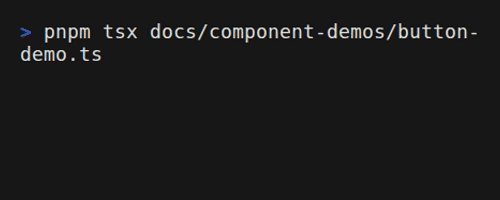

# Button

Interactive button component with multiple variants, sizes, loading states, and icon support.

<div align="center">



</div>

## Import

```typescript
import { Button, IconButton, ButtonGroup } from 'tuiuiu.js'
```

## Button

### Basic Usage

```typescript
Button({ label: 'Click me', onClick: () => console.log('clicked') })
```

### Props

| Prop | Type | Default | Description |
|------|------|---------|-------------|
| `label` | `string` | required | Button label text |
| `onClick` | `() => void` | - | Click handler |
| `variant` | `'solid' \| 'outline' \| 'ghost' \| 'link'` | `'solid'` | Visual variant |
| `size` | `'small' \| 'medium' \| 'large'` | `'medium'` | Button size |
| `color` | `ColorValue` | theme accent | Button color |
| `disabled` | `boolean` | `false` | Disable interaction |
| `loading` | `boolean` | `false` | Show loading spinner |
| `loadingText` | `string` | - | Text to show while loading |
| `icon` | `string` | - | Icon before label |
| `iconRight` | `string` | - | Icon after label |
| `fullWidth` | `boolean` | `false` | Expand to fill container |
| `focused` | `boolean` | `false` | Focus state |
| `hovered` | `boolean` | `false` | Hover state |

### Variants

```typescript
// Solid (default) - filled background
Button({ label: 'Submit', variant: 'solid', color: 'success' })

// Outline - border only
Button({ label: 'Cancel', variant: 'outline' })

// Ghost - minimal, no background
Button({ label: 'Skip', variant: 'ghost' })

// Link - text link style
Button({ label: 'Learn more', variant: 'link' })
```

### With Icons

```typescript
Button({
  label: 'Save',
  icon: '💾',
  variant: 'solid',
  color: 'success',
  onClick: handleSave,
})

// Icon on the right
Button({
  label: 'Next',
  iconRight: '→',
})
```

### Loading State

```typescript
Button({
  label: 'Submit',
  loading: isSubmitting(),
  loadingText: 'Submitting...',
  onClick: handleSubmit,
})
```

### Using Presets

```typescript
import { presets } from 'tuiuiu.js'

// Danger button
Button({ ...presets.dangerButton, label: 'Delete' })

// Success button
Button({ ...presets.successButton, label: 'Save' })

// Ghost button
Button({ ...presets.ghostButton, label: 'Cancel' })
```

## IconButton

Button with just an icon, no label. Ideal for toolbars and compact UI.

```typescript
IconButton({ icon: '🗑️', label: 'Delete', onClick: handleDelete })
```

### Toolbar Example

```typescript
Box({ flexDirection: 'row', gap: 1 },
  IconButton({ icon: '📁', label: 'Open' }),
  IconButton({ icon: '💾', label: 'Save' }),
  IconButton({ icon: '↩️', label: 'Undo' }),
)
```

## ButtonGroup

Group of buttons with **built-in keyboard navigation** - no `useInput` needed!

```typescript
// Out-of-the-box keyboard navigation
ButtonGroup({
  buttons: [
    { label: 'Yes', onClick: handleYes, variant: 'solid', color: 'success' },
    { label: 'No', onClick: handleNo, variant: 'outline' },
    { label: 'Cancel', onClick: handleCancel, variant: 'ghost' },
  ],
})
// Arrow keys navigate, Enter/Space triggers onClick!
```

### Props

| Prop | Type | Default | Description |
|------|------|---------|-------------|
| `buttons` | `ButtonProps[]` | required | Array of button configs |
| `direction` | `'horizontal' \| 'vertical'` | `'horizontal'` | Layout direction |
| `gap` | `number` | `1` | Gap between buttons |
| `isActive` | `boolean \| () => boolean` | `true` | Enable keyboard navigation |
| `wrap` | `boolean` | `true` | Wrap around at edges |
| `onFocusChange` | `(index: number) => void` | - | Called when focus changes |

### Keyboard Shortcuts

| Key | Action |
|-----|--------|
| `←` / `→` | Navigate (horizontal) |
| `↑` / `↓` | Navigate (vertical) |
| `h` / `l` | Vim-style horizontal |
| `j` / `k` | Vim-style vertical |
| `Enter` / `Space` | Trigger onClick |
| `1-9` | Quick access by number |

### Advanced: createButtonGroup

For programmatic control, use `createButtonGroup()`:

```typescript
import { createButtonGroup, renderButtonGroup } from 'tuiuiu.js'

const group = createButtonGroup({
  buttons: [...],
  direction: 'horizontal',
  wrap: true,
  onFocusChange: (index) => console.log('Focused:', index),
})

// Programmatic control
group.focusNext()
group.focusPrev()
group.triggerClick()
group.setFocusedIndex(2)

// Render with keyboard handling
renderButtonGroup(group, buttons)
```

## ConfirmButton

Two-click safety button for destructive actions.

```typescript
import { ConfirmButton, createConfirmButton } from 'tuiuiu.js'

// Simple usage
ConfirmButton({
  label: 'Delete',
  confirmLabel: 'Click again to delete',
  onConfirm: () => deleteItem(),
})

// With state for programmatic control
const btn = createConfirmButton({ onConfirm: handleDelete })
ConfirmButton({ state: btn, label: 'Delete' })

// Cancel with Escape
useInput((_, key) => {
  if (key.escape) btn.cancel()
})
```

### Props

| Prop | Type | Default | Description |
|------|------|---------|-------------|
| `label` | `string` | required | Button label |
| `confirmLabel` | `string` | `'Are you sure?'` | Label during confirmation |
| `variant` | `ButtonVariant` | `'ghost'` | Initial variant |
| `confirmVariant` | `ButtonVariant` | `'solid'` | Variant during confirmation |
| `onConfirm` | `() => void` | - | Called when confirmed |
| `onCancel` | `() => void` | - | Called when cancelled |
| `timeout` | `number` | `3000` | Confirmation timeout (ms) |
| `showCountdown` | `boolean` | `true` | Show remaining time |

## Related

- [Forms](/components/forms.md) - Form components
- [Overlays](/components/overlays.md) - Modals and dialogs
