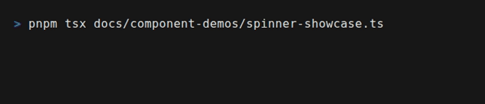

# Spinner

Animated loading indicator with 60+ styles and advanced features.

<div align="center">



</div>

## Import

```typescript
import { Spinner, createSpinner, listSpinnerStyles } from 'tuiuiu.js'
```

## Basic Usage

```typescript
// Simple spinner
Spinner({ style: 'dots' })

// With text
Spinner({ style: 'dots', text: 'Loading...' })

// With color
Spinner({ style: 'arc', text: 'Processing', color: 'cyan' })
```

## Props

| Prop | Type | Default | Description |
|------|------|---------|-------------|
| `style` | `SpinnerStyle` | `'dots'` | Animation style (60+ options) |
| `text` | `string` | - | Text next to spinner |
| `color` | `string` | theme accent | Spinner color |
| `foreground` | `string` | - | Text color |
| `speed` | `number` | `1` | Speed multiplier |
| `showTime` | `boolean` | `false` | Show elapsed time |
| `showProgress` | `boolean` | `false` | Show percentage |
| `progress` | `number` | - | Progress value (0-100) |
| `showTokens` | `boolean` | `false` | Show token count |
| `tokens` | `number` | - | Current token count |
| `rotateText` | `boolean` | `true` | Rotate through texts |
| `textRotateInterval` | `number` | `2000` | Text rotation interval (ms) |
| `hint` | `string` | - | Hint text (e.g., "esc to cancel") |
| `isActive` | `boolean` | `true` | Whether spinner is animating |

## Spinner Styles

### Dots Family (Braille-based)
```typescript
'dots'   // ⠋⠙⠹⠸⠼⠴⠦⠧⠇⠏
'dots2'  // ⣾⣽⣻⢿⡿⣟⣯⣷
'dots3'  // ⠋⠙⠚⠞⠖⠦⠴⠲⠳⠓
// ... dots4 through dots12
```

### Shape-based
```typescript
'arc'           // ◜◠◝◞◡◟
'circle'        // ◐◓◑◒
'circleQuarters'
'circleHalves'
'square'        // ◰◳◲◱
'squareCorners'
'triangle'      // ◢◣◤◥
```

### Line-based
```typescript
'line'   // -\|/
'line2'  // ▁▃▄▅▆▇█▇▆▅▄▃
'pipe'   // ┤┘┴└├┌┬┐
```

### Movement-based
```typescript
'bounce'       // ⠁⠂⠄⠂
'bouncingBar'  // [    ]=>[   =]=>...
'bouncingBall'
'pong'         // ▐⠂ ⠈⠂▐
```

### Emoji-based
```typescript
'clock'     // 🕐🕑🕒...
'earth'     // 🌍🌎🌏
'moon'      // 🌑🌒🌓🌔🌕🌖🌗🌘
'runner'    // 🚶🏃
'hearts'    // 💛💙💜💚❤️
'monkey'    // 🙈🙉🙊
'weather'   // ☀️🌤️⛅🌥️☁️
'christmas' // 🌲🎄
```

### Other Popular Styles
```typescript
'star'      // ✶✸✹✺✹✷
'hamburger' // ☱☲☴
'balloon'   // .oO@*
'noise'     // ▓▒░
'material'  // █▓▒░
'aesthetic' // ▰▱
```

## Advanced Features

### With Progress

```typescript
const [progress, setProgress] = createSignal(0)

Spinner({
  style: 'dots',
  text: 'Downloading...',
  showProgress: true,
  progress: progress(),
})
// Output: ⠋ Downloading... 45%
```

### With Elapsed Time

```typescript
Spinner({
  style: 'dots',
  text: 'Processing',
  showTime: true,
})
// Output: ⠋ Processing [00:05]
```

### With Token Counter

```typescript
Spinner({
  style: 'dots',
  text: 'Generating',
  showTokens: true,
  tokens: 1234,
})
// Output: ⠋ Generating (1.2k tokens)
```

### With Hint

```typescript
Spinner({
  style: 'dots',
  text: 'Loading',
  hint: 'esc to cancel',
})
// Output: ⠋ Loading (esc to cancel)
```

## Programmatic Control

Use `createSpinner()` for full control:

```typescript
const spinner = createSpinner({
  style: 'dots',
  text: 'Loading...',
})

// Update text
spinner.setText('Almost done...')

// Update progress
spinner.setProgress(75)

// Stop animation
spinner.stop()

// Complete with success
spinner.success('Done!')

// Complete with failure
spinner.fail('Error occurred')

// Get current frame
const frame = spinner.frame()
```

## Utility Functions

```typescript
// List all 60+ styles
const styles = listSpinnerStyles()
// ['dots', 'dots2', 'arc', 'circle', ...]

// Get spinner config (frames and interval)
const config = getSpinnerConfig('dots')
// { frames: ['⠋', '⠙', ...], interval: 80 }

// Get count of active spinners
const count = getSpinnerCount()
```

## Examples

### File Download

```typescript
function DownloadProgress({ url, progress }) {
  return Spinner({
    style: 'material',
    text: `Downloading ${url}`,
    showProgress: true,
    progress,
    color: 'cyan',
  })
}
```

### AI Generation

```typescript
function AISpinner({ tokens }) {
  return Spinner({
    style: 'dots',
    text: 'Thinking...',
    showTokens: true,
    tokens,
    showTime: true,
    hint: 'esc to stop',
  })
}
```

### Multiple Spinners

```typescript
Box({ flexDirection: 'column' },
  Spinner({ style: 'dots', text: 'Task 1' }),
  Spinner({ style: 'arc', text: 'Task 2' }),
  Spinner({ style: 'circle', text: 'Task 3' }),
)
```

## ASCII Mode

When terminal doesn't support Unicode, spinners automatically fall back to ASCII-safe versions:

```typescript
// In ASCII mode, 'dots' becomes 'line': -\|/
```

ASCII-safe styles that don't need fallback:
- `line`, `bouncingBar`, `shark`, `binary`, `flip`
- `star2`, `simpleDots`, `simpleDotsScrolling`
- `toggle13`, `dqpb`

## Related

- [ProgressBar](/components/atoms/progress-bar.md) - Progress indicators
- [Timer](/components/atoms/timer.md) - Countdown/elapsed timers
- [Feedback](/components/feedback.md) - All feedback components
