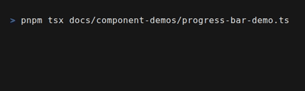

# Feedback Components

Components that provide status updates and feedback to the user.

<div align="center">




</div>

## ProgressBar

Visual indicator of progress with multiple styles.

### Props

| Prop | Type | Default | Description |
| :--- | :--- | :--- | :--- |
| `value` | `number` | - | Current value |
| `max` | `number` | `100` | Max value |
| `style` | `'block' \| 'braille' \| 'line' \| 'gradient'` | `'block'` | Visual style |
| `width` | `number` | `20` | Width in characters |
| `color` | `ColorValue` | `'cyan'` | Bar color |
| `showPercentage` | `boolean` | `false` | Show percentage label |
| `showValue` | `boolean` | `false` | Show current/max values |
| `label` | `string` | - | Label prefix |
| `indeterminate` | `boolean` | `false` | Unknown progress mode |

### Examples

```typescript
// Basic progress
ProgressBar({ value: 45, max: 100 })

// With label and percentage
ProgressBar({
  value: 750,
  max: 1000,
  label: 'Downloading',
  showPercentage: true,
  color: 'green',
})

// Indeterminate (loading)
ProgressBar({
  indeterminate: true,
  label: 'Processing',
  color: 'yellow',
})
```

## MultiProgressBar

Display multiple progress bars for parallel tasks.

### Props

| Prop | Type | Default | Description |
| :--- | :--- | :--- | :--- |
| `bars` | `ProgressBarOptions[]` | - | Array of progress bar configs |
| `direction` | `'horizontal' \| 'vertical'` | `'vertical'` | Layout direction |
| `gap` | `number` | `0` | Gap between bars |

### Example

```typescript
MultiProgressBar({
  bars: [
    { label: 'File 1', value: 100, color: 'green' },
    { label: 'File 2', value: 65, color: 'cyan' },
    { label: 'File 3', value: 30, color: 'yellow' },
  ],
})
```

## Spinner

Animated loading indicator with **60+ styles**.

### Props

| Prop | Type | Default | Description |
| :--- | :--- | :--- | :--- |
| `style` | `SpinnerStyle` | `'dots'` | Animation style |
| `color` | `ColorValue` | `'cyan'` | Spinner color |
| `label` | `string` | - | Loading text |
| `isActive` | `boolean` | `true` | Enable animation |

### Available Styles

**Dots Family (braille-based)**
`dots`, `dots2`, `dots3`, `dots4`, `dots5`, `dots6`, `dots7`, `dots8`, `dots9`, `dots10`, `dots11`, `dots12`

**Line-based**
`line`, `line2`, `pipe`

**Shape-based**
`arc`, `circle`, `circleQuarters`, `circleHalves`, `square`, `squareCorners`, `triangle`

**Movement-based**
`bounce`, `bouncingBar`, `bouncingBall`

**Arrow-based**
`arrow`, `arrow2`, `arrow3`

**Toggle-based**
`toggle`, `toggle2`, `toggle3`, `toggle4`, `toggle5`, `toggle6`, `toggle7`, `toggle8`, `toggle9`, `toggle10`, `toggle11`, `toggle12`, `toggle13`

**Emoji-based**
`clock`, `earth`, `moon`, `runner`, `hearts`, `smiley`, `monkey`, `weather`, `christmas`

**Game-based**
`pong`, `shark`

**Progress-style**
`growVertical`, `growHorizontal`, `material`, `aesthetic`

**Other**
`star`, `star2`, `flip`, `hamburger`, `balloon`, `balloon2`, `noise`, `boxBounce`, `boxBounce2`, `simpleDots`, `simpleDotsScrolling`, `point`, `layer`, `betaWave`, `dwarfFortress`

### Examples

```typescript
// Default dots spinner
Spinner({ style: 'dots', label: 'Loading...' })

// Game-style
Spinner({ style: 'pong', color: 'green' })

// Aesthetic spinner
Spinner({ style: 'aesthetic', label: 'Processing' })

// Emoji spinner
Spinner({ style: 'earth', label: 'Connecting worldwide' })
```

## Timer

Display formatted time for countdowns or stopwatches.

### Props

| Prop | Type | Default | Description |
| :--- | :--- | :--- | :--- |
| `time` | `number` | - | Time in milliseconds |
| `format` | `'ss' \| 'mm:ss' \| 'hh:mm:ss' \| 'hh:mm:ss.ms' \| 'human'` | `'mm:ss'` | Display format |
| `color` | `ColorValue` | `'white'` | Text color |
| `running` | `boolean` | `false` | Timer is running |
| `paused` | `boolean` | `false` | Timer is paused |
| `runningIndicator` | `string` | `'●'` | Running indicator icon |
| `pausedIndicator` | `string` | `'❚❚'` | Paused indicator icon |
| `showIndicator` | `boolean` | `true` | Show status indicator |
| `label` | `string` | - | Label prefix |
| `bold` | `boolean` | `true` | Bold text |
| `dimWhenPaused` | `boolean` | `true` | Dim when paused |

### Examples

```typescript
// Stopwatch
const timer = createTimer({ mode: 'stopwatch' })
timer.start()

Timer({
  time: timer.elapsed(),
  format: 'mm:ss',
  running: timer.isRunning(),
})

// Countdown with color change
Timer({
  time: countdown.remaining(),
  format: 'mm:ss',
  color: countdown.remaining() < 10000 ? 'red' : 'green',
})

// Human-readable format
Timer({
  time: 3661000, // 1 hour, 1 minute, 1 second
  format: 'human', // "1h 1m 1s"
})
```

### Creating Timer State

```typescript
import { createTimer } from 'tuiuiu.js'

// Stopwatch (counts up)
const stopwatch = createTimer({ mode: 'stopwatch' })

// Countdown (counts down)
const countdown = createTimer({
  mode: 'countdown',
  initialTime: 60000, // 60 seconds
  onComplete: () => console.log('Time up!'),
})

// Controls
stopwatch.start()
stopwatch.pause()
stopwatch.resume()
stopwatch.reset()

// State
stopwatch.elapsed()    // Current time in ms
stopwatch.isRunning()  // Is timer running
stopwatch.isPaused()   // Is timer paused
```

## Badge

Small status label with background color and multiple variants.

### Props

| Prop | Type | Default | Description |
| :--- | :--- | :--- | :--- |
| `label` | `string` | - | Badge text |
| `color` | `ColorValue` | `'gray'` | Badge color |
| `variant` | `'filled' \| 'outline' \| 'subtle'` | `'filled'` | Visual style |
| `size` | `'small' \| 'medium'` | `'medium'` | Badge size |

### Examples

```typescript
// Status badges
Badge({ label: 'ONLINE', color: 'green' })
Badge({ label: 'OFFLINE', color: 'red' })
Badge({ label: 'PENDING', color: 'yellow', variant: 'outline' })

// With presets
import { statusSuccess, statusWarning, statusError } from 'tuiuiu.js'

statusSuccess('Active')
statusWarning('Degraded')
statusError('Failed')
```

## Toast

Transient notification message.

### Props

| Prop | Type | Default | Description |
| :--- | :--- | :--- | :--- |
| `message` | `string` | - | Notification text |
| `type` | `'info' \| 'success' \| 'warning' \| 'error'` | `'info'` | Toast type |
| `position` | `'top' \| 'bottom'` | `'bottom'` | Screen position |
| `duration` | `number` | `3000` | Auto-dismiss time (ms) |

### Example

```typescript
Toast({
  message: 'File saved successfully',
  type: 'success',
  position: 'bottom',
})
```

## AlertBox

A boxed message for highlighting important information.

### Props

| Prop | Type | Default | Description |
| :--- | :--- | :--- | :--- |
| `title` | `string` | - | Alert title |
| `message` | `string` | - | Alert message |
| `type` | `'info' \| 'success' \| 'warning' \| 'error'` | `'info'` | Alert type |
| `width` | `number` | `40` | Box width |

### Example

```typescript
AlertBox({
  title: 'Warning',
  message: 'This action cannot be undone.',
  type: 'warning',
})

AlertBox({
  title: 'Success',
  message: 'Changes saved successfully.',
  type: 'success',
})
```

## Dashboard Example

Combining feedback components in a status dashboard:

```typescript
function StatusDashboard() {
  const downloads = createTimer({ mode: 'stopwatch' })
  downloads.start()

  return Box({ flexDirection: 'column', padding: 2, gap: 1 },
    // Header
    Box({ flexDirection: 'row', gap: 2 },
      Badge({ label: 'ACTIVE', color: 'green' }),
      Timer({
        time: downloads.elapsed(),
        format: 'mm:ss',
        label: 'Elapsed',
        running: true,
      }),
    ),

    // Progress section
    Text({ bold: true, marginTop: 1 }, 'Downloads'),
    MultiProgressBar({
      bars: [
        { label: 'package.tar.gz', value: 100, color: 'green' },
        { label: 'assets.zip', value: 67, color: 'cyan' },
        { label: 'docs.pdf', value: 23, color: 'yellow' },
      ],
    }),

    // Current operation
    Box({ marginTop: 1, flexDirection: 'row', gap: 1 },
      Spinner({ style: 'dots', color: 'cyan' }),
      Text({}, 'Extracting files...'),
    ),
  )
}
```

## Related

- [Button](/components/atoms/button.md) - Interactive buttons
- [Modal](/components/organisms/modal.md) - Modal dialogs
- [Data Visualization](/components/viz/index.md) - Charts and gauges
