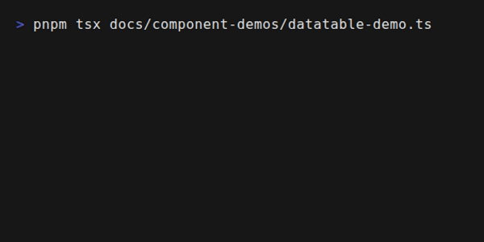

# DataTable

Interactive data table with sorting, filtering, pagination, and selection.

<div align="center">



</div>

## Import

```typescript
import { DataTable, createDataTable, VirtualDataTable, EditableDataTable } from 'tuiuiu.js'
```

## Basic Usage

```typescript
DataTable({
  columns: [
    { key: 'name', header: 'Name', sortable: true },
    { key: 'age', header: 'Age', sortable: true, align: 'right' },
    { key: 'email', header: 'Email' },
  ],
  data: users,
  showSearch: true,
  showPagination: true,
  pageSize: 10,
})
```

## DataTableColumn Interface

Extends `TableColumn` with interactive features:

| Field | Type | Description |
|-------|------|-------------|
| `key` | `string` | Data key |
| `header` | `string` | Header label |
| `sortable` | `boolean` | Enable sorting |
| `filterable` | `boolean` | Include in search |
| `sortFn` | `(a, b, direction) => number` | Custom sort function |
| `filterFn` | `(value, filter, row) => boolean` | Custom filter |
| `width` | `number` | Column width |
| `align` | `'left' \| 'center' \| 'right'` | Text alignment |
| `format` | `(value, row) => string` | Value formatter |

## Props

| Prop | Type | Default | Description |
|------|------|---------|-------------|
| `columns` | `DataTableColumn[]` | required | Column definitions |
| `data` | `T[]` | required | Row data |
| `getRowKey` | `(row, index) => string` | index | Row key extractor |
| `selectionMode` | `'none' \| 'single' \| 'multiple'` | `'single'` | Selection mode |
| `initialSelected` | `string[]` | `[]` | Initially selected keys |
| `pageSize` | `number` | `10` | Rows per page |
| `showPagination` | `boolean` | `true` | Show pagination |
| `showSearch` | `boolean` | `true` | Show search input |
| `searchPlaceholder` | `string` | `'Search...'` | Search placeholder |
| `initialSort` | `{ column, direction }` | - | Initial sort |
| `borderStyle` | `TableBorderStyle` | `'single'` | Border style |
| `borderColor` | `ColorValue` | `'border'` | Border color |
| `colorHeader` | `ColorValue` | `'foreground'` | Header color |
| `headerBold` | `boolean` | `true` | Bold headers |
| `colorSelected` | `ColorValue` | `'primary'` | Selected row color |
| `colorCursor` | `ColorValue` | `'warning'` | Cursor row color |
| `striped` | `boolean` | `false` | Zebra striping |
| `colorStripe` | `ColorValue` | `'mutedForeground'` | Stripe color |
| `maxHeight` | `number` | - | Max visible rows |
| `onSelect` | `(rows: T[]) => void` | - | Selection callback |
| `onSort` | `(column, direction) => void` | - | Sort callback |
| `onPageChange` | `(page: number) => void` | - | Page change callback |
| `isActive` | `boolean` | `true` | Handle keyboard |
| `state` | `DataTableState` | - | External state |

## Keyboard Shortcuts

| Key | Action |
|-----|--------|
| `↑` / `k` | Move cursor up |
| `↓` / `j` | Move cursor down |
| `←` / `h` | Previous page |
| `→` / `l` | Next page |
| `Enter` / `Space` | Toggle selection |
| `s` | Cycle sort columns |
| `Ctrl+A` | Select all |
| `Ctrl+D` | Deselect all |
| `/` | Focus search |
| Type | Filter text |
| `Backspace` | Delete filter char |

## Programmatic Control

```typescript
const state = createDataTable({
  columns: [...],
  data: [...],
  onSelect: (rows) => console.log('Selected:', rows),
})

// Sorting
state.sort('name')           // Sort by column

// Filtering
state.setFilter('john')      // Set filter text

// Pagination
state.nextPage()             // Go to next page
state.prevPage()             // Go to previous page
state.goToPage(3)            // Go to specific page

// Selection
state.selectRow('id1')       // Select by key
state.deselectRow('id1')     // Deselect by key
state.toggleRow('id1')       // Toggle selection
state.selectAll()            // Select all on page
state.deselectAll()          // Deselect all

// Cursor
state.moveCursor(1)          // Move cursor down
state.moveCursor(-1)         // Move cursor up
state.selectCurrent()        // Select current row

// State access
state.sortColumn()           // Current sort column
state.sortDirection()        // 'asc' | 'desc' | null
state.filterText()           // Current filter text
state.currentPage()          // Current page (0-indexed)
state.totalPages()           // Total pages
state.filteredData()         // Data after filter
state.sortedData()           // Data after sort
state.pageData()             // Data for current page
state.selectedKeys()         // Set of selected keys
state.cursorIndex()          // Current cursor index
state.getRowKey(row, idx)    // Get row key

// Use with component
DataTable({ state, columns: [...], data: state.pageData() })
```

## Sort Direction

Sort cycles through three states:

1. `null` - No sort
2. `'asc'` - Ascending (▲)
3. `'desc'` - Descending (▼)

## VirtualDataTable

For large datasets with virtual scrolling:

```typescript
VirtualDataTable({
  columns: [...],
  data: largeDataset, // 10000+ rows
  visibleRows: 20,
  overscan: 3,
  pageSize: 0, // Disable pagination
})
```

### VirtualDataTable Props

| Prop | Type | Default | Description |
|------|------|---------|-------------|
| `visibleRows` | `number` | `20` | Visible row count |
| `rowHeight` | `number` | - | Row height for scrolling |
| `overscan` | `number` | `3` | Extra rows to render |

## EditableDataTable

Table with inline cell editing:

```typescript
EditableDataTable({
  columns: [
    { key: 'name', header: 'Name', editable: true },
    { key: 'age', header: 'Age', editable: true, inputType: 'number' },
    {
      key: 'status',
      header: 'Status',
      editable: true,
      inputType: 'select',
      options: [
        { value: 'active', label: 'Active' },
        { value: 'inactive', label: 'Inactive' },
      ],
    },
  ],
  data: [...],
  onCellEdit: (rowKey, column, value, row) => {
    console.log('Edit:', rowKey, column, value)
  },
})
```

### EditableColumn Props

| Prop | Type | Description |
|------|------|-------------|
| `editable` | `boolean` | Enable editing |
| `inputType` | `'text' \| 'number' \| 'select'` | Input type |
| `options` | `{ value, label }[]` | Options for select |
| `validate` | `(value, row) => boolean \| string` | Validation |

## Examples

### User Management Table

```typescript
const columns = [
  {
    key: 'name',
    header: 'Name',
    sortable: true,
    filterable: true,
  },
  {
    key: 'email',
    header: 'Email',
    sortable: true,
  },
  {
    key: 'role',
    header: 'Role',
    sortable: true,
    format: (v) => v.toUpperCase(),
  },
  {
    key: 'status',
    header: 'Status',
    format: (v) => v === 'active' ? '🟢 Active' : '🔴 Inactive',
    sortFn: (a, b, dir) => {
      const order = a.status === 'active' ? -1 : 1
      return dir === 'desc' ? -order : order
    },
  },
]

DataTable({
  columns,
  data: users,
  selectionMode: 'multiple',
  showSearch: true,
  showPagination: true,
  pageSize: 15,
  onSelect: (rows) => setSelectedUsers(rows),
})
```

### Product Inventory

```typescript
DataTable({
  columns: [
    { key: 'sku', header: 'SKU', width: 10 },
    { key: 'name', header: 'Product', sortable: true, filterable: true },
    {
      key: 'price',
      header: 'Price',
      align: 'right',
      sortable: true,
      format: (v) => `$${v.toFixed(2)}`,
    },
    {
      key: 'stock',
      header: 'Stock',
      align: 'center',
      sortable: true,
      format: (v) => v < 10 ? `⚠️ ${v}` : String(v),
    },
  ],
  data: products,
  initialSort: { column: 'stock', direction: 'asc' },
  striped: true,
})
```

### Custom Row Keys

```typescript
DataTable({
  columns: [...],
  data: items,
  getRowKey: (row) => row.id, // Use item.id as key
  selectionMode: 'multiple',
  onSelect: (rows) => {
    const ids = rows.map(r => r.id)
    console.log('Selected IDs:', ids)
  },
})
```

### Custom Sort Function

```typescript
{
  key: 'priority',
  header: 'Priority',
  sortable: true,
  sortFn: (a, b, direction) => {
    const order = { high: 1, medium: 2, low: 3 }
    const diff = order[a.priority] - order[b.priority]
    return direction === 'desc' ? -diff : diff
  },
}
```

### Custom Filter Function

```typescript
{
  key: 'tags',
  header: 'Tags',
  filterable: true,
  filterFn: (value, filter, row) => {
    // value is the tags array
    return value.some(tag =>
      tag.toLowerCase().includes(filter.toLowerCase())
    )
  },
}
```

## Related

- [Table](/components/molecules/table.md) - Basic table display
- [Select](/components/molecules/select.md) - Selection component
- [Modal](/components/organisms/modal.md) - Modal dialogs

