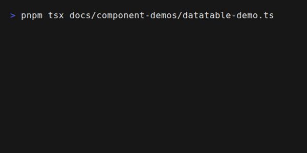

# DataTable

Interactive data table with sorting, filtering, pagination, and selection.

<div align="center">



</div>

## Import

```typescript
import {
  DataTable,
  useDataTableState,
  createDataTable,
} from 'tuiuiu.js'

// Explicitly experimental; contracts may change between minor releases.
import {
  createVirtualDataTable,
  VirtualDataTable,
  EditableDataTable,
} from 'tuiuiu.js/experimental'
```

## Basic Usage

```typescript
DataTable({
  columns: [
    { key: 'name', header: 'Name', sortable: true },
    { key: 'age', header: 'Age', sortable: true, align: 'right' },
    { key: 'email', header: 'Email' },
  ],
  data: users,
  showSearch: true,
  showPagination: true,
  pageSize: 10,
})
```

## DataTableColumn Interface

Extends `TableColumn` with interactive features:

| Field | Type | Description |
|-------|------|-------------|
| `key` | `string` | Data key |
| `header` | `string` | Header label |
| `sortable` | `boolean` | Enable sorting |
| `filterable` | `boolean` | Include in search |
| `sortFn` | `(a, b, direction) => number` | Custom sort function |
| `filterFn` | `(value, filter, row) => boolean` | Custom filter |
| `width` | `number` | Column width |
| `align` | `'left' \| 'center' \| 'right'` | Text alignment |
| `format` | `(value, row) => string` | Value formatter |

## Props

| Prop | Type | Default | Description |
|------|------|---------|-------------|
| `columns` | `DataTableColumn[]` | required | Column definitions |
| `data` | `T[]` | required | Row data |
| `getRowKey` | `(row, index) => string` | index | Row key extractor |
| `selectionMode` | `'none' \| 'single' \| 'multiple'` | `'single'` | Selection mode |
| `initialSelected` | `string[]` | `[]` | Initially selected keys |
| `pageSize` | `number` | `10` | Rows per page |
| `showPagination` | `boolean` | `true` | Show pagination |
| `showSearch` | `boolean` | `true` | Show search input |
| `searchPlaceholder` | `string` | `'Search...'` | Search placeholder |
| `initialSort` | `{ column, direction }` | - | Initial sort |
| `borderStyle` | `TableBorderStyle` | `'single'` | Border style |
| `borderColor` | `ColorValue` | `'border'` | Border color |
| `colorHeader` | `ColorValue` | `'foreground'` | Header color |
| `headerBold` | `boolean` | `true` | Bold headers |
| `colorSelected` | `ColorValue` | `'primary'` | Selected row color |
| `colorCursor` | `ColorValue` | `'warning'` | Cursor row color |
| `striped` | `boolean` | `false` | Zebra striping |
| `colorStripe` | `ColorValue` | `'mutedForeground'` | Stripe color |
| `maxHeight` | `number` | - | Max visible rows |
| `onSelect` | `(rows: T[]) => void` | - | Selection callback |
| `onSort` | `(column, direction) => void` | - | Sort callback |
| `onPageChange` | `(page: number) => void` | - | Page change callback |
| `accessibilityLabel` | `string` | `'Data table'` | Semantic label for accessibility tooling and alternative renderers |
| `isActive` | `boolean` | `true` | Handle keyboard |
| `state` | `DataTableState` | - | External state |

## Keyboard Shortcuts

| Key | Action |
|-----|--------|
| `↑` / `k` | Move cursor up |
| `↓` / `j` | Move cursor down |
| `←` / `h` | Previous page |
| `→` / `l` | Next page |
| `Enter` / `Space` | Toggle selection |
| `s` | Cycle sort columns |
| `Ctrl+A` | Select all |
| `Ctrl+D` | Deselect all |
| `/` | Enter search mode |
| Type | Filter text while search mode is active |
| `Backspace` | Delete one Unicode grapheme while searching |
| `Enter` / `Escape` | Leave search mode without clearing the filter |

## Programmatic Control

```typescript
const state = useDataTableState({
  columns: [...],
  data: [...],
  onSelect: (rows) => console.log('Selected:', rows),
})

// Sorting
state.sort('name')           // Sort by column

// Filtering
state.setFilter('john')      // Set filter text
state.startSearch()          // Route text input to the filter
state.stopSearch()           // Return to navigation shortcuts
state.searchActive()         // Whether search owns text input

// Pagination
state.nextPage()             // Go to next page
state.prevPage()             // Go to previous page
state.goToPage(3)            // Go to specific page

// Selection
state.selectRow('id1')       // Select by key
state.deselectRow('id1')     // Deselect by key
state.toggleRow('id1')       // Toggle selection
state.selectAll()            // Select all on page
state.deselectAll()          // Deselect all

// Cursor
state.moveCursor(1)          // Move cursor down
state.moveCursor(-1)         // Move cursor up
state.selectCurrent()        // Select current row

// State access
state.sortColumn()           // Current sort column
state.sortDirection()        // 'asc' | 'desc' | null
state.filterText()           // Current filter text
state.currentPage()          // Current page (0-indexed)
state.totalPages()           // Total pages
state.filteredData()         // Data after filter
state.sortedData()           // Data after sort
state.pageData()             // Data for current page
state.selectedKeys()         // Set of selected keys
state.cursorIndex()          // Current cursor index
state.getRowKey(row, idx)    // Get row key

// Use with component
DataTable({ state, columns: [...], data: [...] })
```

Use `useDataTableState()` inside components when you need a stable controller across parent rerenders.
Keep `createDataTable()` for advanced factories or controllers created outside the render path.

`selectAll()` adds the active page to an existing multi-page selection.
`onSelect` is emitted for selection and deselection operations with every
currently selected row that is present in the filtered/sorted dataset. Supply a
stable `getRowKey` whenever rows can be sorted, filtered, reordered, or replaced;
the index fallback is intended only for static data.

## Accessibility

The rendered table never relies on color alone: a leading marker identifies the
keyboard cursor, and the status line includes the current row, selection count,
sort, filter, and visible range. Grid, row, column-header, and cell metadata is
also attached to the VNode tree for accessibility tests and alternative
renderers. Terminal screen readers consume the visible terminal stream, so the
text marker and status line remain the authoritative fallback.

Headers and cells are measured, aligned, and truncated in terminal columns,
preserving ANSI styles and Unicode grapheme clusters such as CJK text, flags,
combining marks, and ZWJ emoji.

## Sort Direction

Sort cycles through three states:

1. `null` - No sort
2. `'asc'` - Ascending (▲)
3. `'desc'` - Descending (▼)

## VirtualDataTable

> **Experimental:** this component uses real windowed rendering while its API
> remains eligible for changes between minor versions.

```typescript
const state = createVirtualDataTable({
  columns: [...],
  data: largeDataset,
  visibleRows: 20,
  overscan: 3,
  initialScrollOffset: 100,
})

VirtualDataTable({ state, columns: [...], data: largeDataset })

state.scrollTo(500)
```

The underlying `DataTable` keeps the full filtered and sorted dataset, but only
the visible row window is converted into row nodes. Cursor and selection indices
remain global. Overscan samples nearby rows when calculating column widths, so
widths are less likely to jump without rendering those extra rows.

### VirtualDataTable Props

| Prop | Type | Default | Description |
|------|------|---------|-------------|
| `visibleRows` | `number` | `20` | Visible row count |
| `rowHeight` | `number` | `1` | Fixed rendered height of each row |
| `overscan` | `number` | `3` | Nearby rows sampled for width measurement |
| `initialScrollOffset` | `number` | `0` | Initial logical row at the top |
| `state` | `VirtualDataTableState` | - | External virtual table controller |
| `onScroll` | `(offset) => void` | - | Called when the logical offset changes |

## EditableDataTable

> **Experimental:** inline editing is implemented, but this API can still
> change between minor versions. Data is controlled: apply `onCellEdit` to your
> store and provide the updated `data` on the next render.

```typescript
EditableDataTable({
  columns: [
    { key: 'name', header: 'Name', editable: true },
    { key: 'age', header: 'Age', editable: true, inputType: 'number' },
    {
      key: 'status',
      header: 'Status',
      editable: true,
      inputType: 'select',
      options: [
        { value: 'active', label: 'Active' },
        { value: 'inactive', label: 'Inactive' },
      ],
    },
  ],
  data: [...],
  onCellEdit: (rowKey, column, value, row) => {
    console.log('Edit:', rowKey, column, value)
  },
})
```

Keyboard behavior:

- Arrow keys move the row or editable-column focus.
- Enter opens the focused editor and commits an active edit.
- Escape cancels the draft.
- Tab or Shift+Tab commits and moves to the next or previous editable column.
- Select editors cycle with arrow keys.
- Page Up and Page Down change pages outside edit mode.

Text editing moves and deletes by Unicode grapheme cluster. Number editors emit
finite numbers rather than strings. A failed `validate` result leaves the
editor open and renders its message.

Use `createEditableDataTable(options)` and pass the resulting `state` when
focus, draft, validation, or commit actions need to be controlled externally.

### EditableColumn Props

| Prop | Type | Description |
|------|------|-------------|
| `editable` | `boolean` | Enable editing |
| `inputType` | `'text' \| 'number' \| 'select'` | Input type |
| `options` | `{ value, label }[]` | Options for select |
| `validate` | `(value, row) => boolean \| string` | Validation |
| `state` | `EditableDataTableState` | External editable-table controller |
| `onCellEdit` | `(rowKey, column, value, row) => void` | Controlled data update callback |

## Examples

### User Management Table

```typescript
const columns = [
  {
    key: 'name',
    header: 'Name',
    sortable: true,
    filterable: true,
  },
  {
    key: 'email',
    header: 'Email',
    sortable: true,
  },
  {
    key: 'role',
    header: 'Role',
    sortable: true,
    format: (v) => v.toUpperCase(),
  },
  {
    key: 'status',
    header: 'Status',
    format: (v) => v === 'active' ? '🟢 Active' : '🔴 Inactive',
    sortFn: (a, b, dir) => {
      const order = a.status === 'active' ? -1 : 1
      return dir === 'desc' ? -order : order
    },
  },
]

DataTable({
  columns,
  data: users,
  selectionMode: 'multiple',
  showSearch: true,
  showPagination: true,
  pageSize: 15,
  onSelect: (rows) => setSelectedUsers(rows),
})
```

### Product Inventory

```typescript
DataTable({
  columns: [
    { key: 'sku', header: 'SKU', width: 10 },
    { key: 'name', header: 'Product', sortable: true, filterable: true },
    {
      key: 'price',
      header: 'Price',
      align: 'right',
      sortable: true,
      format: (v) => `$${v.toFixed(2)}`,
    },
    {
      key: 'stock',
      header: 'Stock',
      align: 'center',
      sortable: true,
      format: (v) => v < 10 ? `⚠️ ${v}` : String(v),
    },
  ],
  data: products,
  initialSort: { column: 'stock', direction: 'asc' },
  striped: true,
})
```

### Custom Row Keys

```typescript
DataTable({
  columns: [...],
  data: items,
  getRowKey: (row) => row.id, // Use item.id as key
  selectionMode: 'multiple',
  onSelect: (rows) => {
    const ids = rows.map(r => r.id)
    console.log('Selected IDs:', ids)
  },
})
```

### Custom Sort Function

```typescript
{
  key: 'priority',
  header: 'Priority',
  sortable: true,
  sortFn: (a, b, direction) => {
    const order = { high: 1, medium: 2, low: 3 }
    const diff = order[a.priority] - order[b.priority]
    return direction === 'desc' ? -diff : diff
  },
}
```

### Custom Filter Function

```typescript
{
  key: 'tags',
  header: 'Tags',
  filterable: true,
  filterFn: (value, filter, row) => {
    // value is the tags array
    return value.some(tag =>
      tag.toLowerCase().includes(filter.toLowerCase())
    )
  },
}
```

## Related

- [Table](/components/molecules/table.md) - Basic table display
- [Select](/components/molecules/select.md) - Selection component
- [Modal](/components/organisms/modal.md) - Modal dialogs
