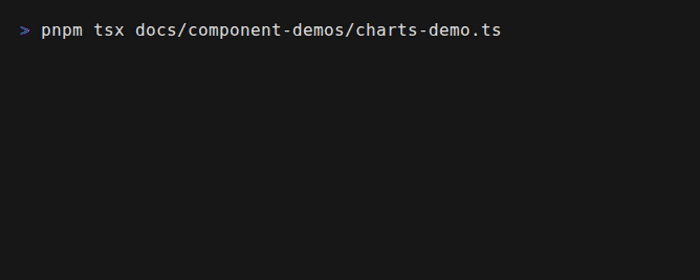
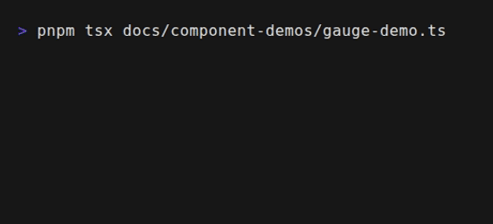

# Data Visualization

Tuiuiu provides a comprehensive set of data visualization components for building dashboards and data-driven terminal applications.

<div align="center">



*Live Sparklines and Bar Charts*



*System Gauges with Zones*

</div>

## Overview

| Category | Components |
|----------|------------|
| **Line Charts** | LineChart, AreaChart, Sparkline |
| **Bar Charts** | BarChart, VerticalBarChart, StackedBarChart |
| **Gauges** | Gauge, MeterGauge, ArcGauge, DialGauge, BatteryGauge |
| **Heatmaps** | Heatmap, ContributionGraph, CalendarHeatmap, CorrelationMatrix, TimeHeatmap |
| **Other** | ScatterPlot, RadarChart, GanttChart, Legend |

## Import

```typescript
import {
  // Line charts
  LineChart, AreaChart, Sparkline,
  // Bar charts
  BarChart, VerticalBarChart, StackedBarChart,
  // Gauges
  Gauge, MeterGauge, ArcGauge, DialGauge, BatteryGauge,
  // Heatmaps
  Heatmap, ContributionGraph, CalendarHeatmap, CorrelationMatrix,
  // Other
  ScatterPlot, RadarChart, GanttChart, Legend,
} from 'tuiuiu.js'
```

## Quick Examples

### Sparkline

Inline mini-charts for displaying trends in compact spaces.

```typescript
Sparkline({
  data: [5, 10, 8, 12, 7, 15],
  width: 20,
  height: 1,
  color: 'cyan',
})
```

### Line Chart

Full-featured line chart with axis labels and multiple series.

```typescript
LineChart({
  data: [
    { x: 0, y: 10 },
    { x: 1, y: 25 },
    { x: 2, y: 18 },
    { x: 3, y: 30 },
  ],
  width: 60,
  height: 15,
  showAxis: true,
  color: 'blue',
})
```

### Bar Chart

Horizontal or vertical bar charts.

```typescript
BarChart({
  data: [
    { label: 'Sales', value: 150, color: 'green' },
    { label: 'Expenses', value: 80, color: 'red' },
    { label: 'Profit', value: 70, color: 'cyan' },
  ],
  width: 40,
})
```

### Gauge

Circular gauge for displaying single values.

```typescript
Gauge({
  value: 75,
  min: 0,
  max: 100,
  label: 'CPU',
  showValue: true,
  zones: [
    { min: 0, max: 50, color: 'green' },
    { min: 50, max: 80, color: 'yellow' },
    { min: 80, max: 100, color: 'red' },
  ],
})
```

### Heatmap

Grid-based heatmap visualization.

```typescript
Heatmap({
  data: [
    { x: 0, y: 0, value: 10 },
    { x: 1, y: 0, value: 25 },
    { x: 2, y: 0, value: 5 },
    // ...
  ],
  colorScale: 'blues',
  showValues: true,
})
```

## Pages

- [Bar Charts](bar-chart.md) - Horizontal and vertical bars
- [Sparklines](sparkline.md) - Inline mini-charts
- [Charts](charts.md) - Line charts, area charts, scatter plots
- [Gauges](gauges.md) - Circular and linear gauges
- [Heatmaps](heatmaps.md) - Grid-based visualizations

## Dashboard Example

```typescript
function Dashboard() {
  const cpuData = useCpuData()
  const memoryData = useMemoryData()
  const networkData = useNetworkData()

  return Box({ flexDirection: 'column', gap: 1 },
    // Header with gauges
    Box({ flexDirection: 'row', gap: 2 },
      Gauge({ value: cpuData.percent, label: 'CPU', zones: defaultZones }),
      Gauge({ value: memoryData.percent, label: 'Memory', zones: defaultZones }),
      BatteryGauge({ value: 85, showLabel: true }),
    ),

    // Sparklines row
    Box({ flexDirection: 'row', gap: 2 },
      Box({ flexDirection: 'column' },
        Text({}, 'Network In'),
        Sparkline({ data: networkData.in, width: 30, color: 'green' }),
      ),
      Box({ flexDirection: 'column' },
        Text({}, 'Network Out'),
        Sparkline({ data: networkData.out, width: 30, color: 'red' }),
      ),
    ),

    // Main chart
    LineChart({
      data: cpuData.history,
      width: 60,
      height: 10,
      showAxis: true,
      title: 'CPU History',
    }),
  )
}
```

## Related

- [Data Display](/components/data-display.md) - Tables and trees
- [Feedback](/components/feedback.md) - Progress bars and spinners
