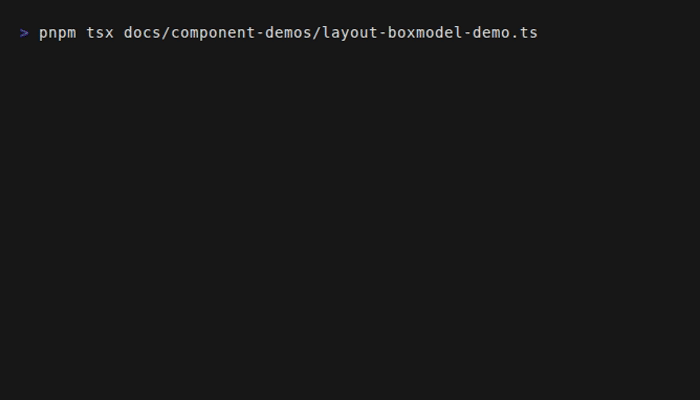

# Layout System

Tuiuiu implements a **Flexbox-inspired** layout engine optimized for terminal
cells. Its typed props borrow familiar names, but no browser CSS engine or
stylesheet is involved.

The layout system is built into the `Box` component, which serves as the fundamental building block for all UI elements.



## The Box Model

Every visual element in Tuiuiu is a rectangular box. The terminal layout engine
calculates size and position using content, padding, border, and margin regions:

```
┌───────────────────────────────────────┐
│                Margin                 │
│  ┌─────────────────────────────────┐  │
│  │             Border              │  │
│  │  ┌───────────────────────────┐  │  │
│  │  │         Padding           │  │  │
│  │  │  ┌─────────────────────┐  │  │  │
│  │  │  │       Content       │  │  │  │
│  │  │  └─────────────────────┘  │  │  │
│  │  └───────────────────────────┘  │  │
│  └─────────────────────────────────┘  │
└───────────────────────────────────────┘
```

- **Content**: The size of text or children.
- **Padding**: Space inside the border, surrounding the content.
- **Border**: A 1-character wide border (optional).
- **Margin**: Space outside the border, separating the box from neighbors.

### Box Properties

| Property | Type | Description |
| :--- | :--- | :--- |
| `width`, `height` | `number` \| `string` \| `'auto'` \| `'fill'` | Fixed dimensions or sizing tokens (e.g. `20`, `'50%'`). |
| `minWidth`, `minHeight` | `number` | Minimum dimensions. |
| `maxWidth`, `maxHeight` | `number` | Maximum dimensions. |
| `padding` | `number` | Padding on all sides. |
| `paddingX`, `paddingY` | `number` | Horizontal / Vertical padding. |
| `paddingTop`, `paddingBottom`, `paddingLeft`, `paddingRight` | `number` | Individual side padding. |
| `margin` | `number` | Margin on all sides. |
| `marginX`, `marginY` | `number` | Horizontal / Vertical margin. |
| `marginTop`, `marginBottom`, `marginLeft`, `marginRight` | `number` | Individual side margin. |
| `borderStyle` | `string` | Style of the border (e.g., `'round'`, `'single'`). |
| `borderColor` | `string` | Color of the border. |

### Auto & Fill Tokens

Tuiuiu adds two terminal-friendly sizing tokens:

| Token | Behavior | Use Case |
|:------|:---------|:---------|
| `'auto'` | Size to content | Headers, footers, buttons |
| `'fill'` | Expand to fill remaining space | Main content, sidebars |

```typescript
// Fill remaining height in a column
Box({ flexDirection: 'column', height: 'fill' },
  Header(),
  Box({ height: 'fill' }, Content())
)

// Size to content width/height
Box({ width: 'auto', height: 'auto' }, Text({}, 'Hello'))
```

### Layout Primitives

For common terminal layouts, use the **layout primitives** which have sensible sizing defaults:

```typescript
import { screen, header, main, footer, sidebar } from 'tuiuiu.js';

screen(
  header(Title('App')),     // height: 'auto', width: 'fill'
  main(Content()),          // height: 'fill'
  footer(Status())          // height: 'auto'
)
```

| Primitive | Default Sizing |
|:----------|:---------------|
| `Screen` | Terminal width/height, column layout |
| `Header` | `height: 'auto'`, `width: 'fill'`, row layout |
| `Main` | `height: 'fill'`, column layout |
| `Footer` | `height: 'auto'`, row layout |
| `Sidebar` | `height: 'fill'`, `width: 'auto'`, column layout |
| `Panel` | Bordered container with padding |

### Layout References

Use `createLayoutRef()` or `useLayoutRef()` when a component needs its measured bounds after layout:

```typescript
const ref = useLayoutRef()

return Box(
  { layoutRef: ref, borderStyle: 'round' },
  Text({}, `width=${ref.width()} height=${ref.height()}`)
)
```

See [Layout Components](/components/layout.md) for full documentation.

## Flexbox System

The `Box` component acts as a Flex Container. Its children are Flex Items.

## Layout Reuse Cache

The layout engine now keeps a conservative subtree cache on top of text measurement caching.

It reuses a previously computed `LayoutNode` when all of the following still match:

- the same `VNode` object is being laid out again
- the same parent constraints are being applied (`x`, `y`, `width`, `height`)
- the node props relevant to layout have not changed
- the direct child references of that node are still the same

This matters most for:

- static panels or widgets hoisted outside reactive updates
- shared subtrees reused across parent rerenders
- repeated frame assembly on the same committed tree

The cache is intentionally conservative. If layout-affecting props or constraints change, the node is laid out again instead of risking stale geometry.

Practical implication: if you want the fastest steady-state rendering, keep static branches stable and only recreate the nodes that actually changed.

### Flex Container Properties

Control how children are arranged.

| Property | Values | Description |
| :--- | :--- | :--- |
| `flexDirection` | `'row'` (default), `'column'`, `'row-reverse'`, `'column-reverse'` | Direction of the main axis. |
| `justifyContent` | `'flex-start'` (default), `'center'`, `'flex-end'`, `'space-between'`, `'space-around'` | Alignment along the main axis. |
| `alignItems` | `'flex-start'` (default), `'center'`, `'flex-end'`, `'stretch'` | Alignment along the cross axis. |
| `flexWrap` | `'nowrap'` (default), `'wrap'`, `'wrap-reverse'` | Whether items wrap to the next line. |
| `gap` | `number` | Space between items. |
| `rowGap`, `columnGap` | `number` | Specific gap for rows/columns. |

#### Direction & Alignment

**Row (default)**
```
flexDirection: 'row'
Main Axis: ──►
Cross Axis: ↓
```

**Column**
```
flexDirection: 'column'
Main Axis: ↓
Cross Axis: ──►
```

### Flex Item Properties

Control how an individual item behaves within the container.

| Property | Values | Description |
| :--- | :--- | :--- |
| `flexGrow` | `number` (default `0`) | Factor to grow to fill available space. |
| `flexShrink` | `number` (default `1`) | Factor to shrink if space is tight. |
| `flexBasis` | `number` \| `'auto'` | Initial size before growing/shrinking. |
| `alignSelf` | `'auto'`, `'flex-start'`, `'center'`, `'flex-end'`, `'stretch'` | Overrides `alignItems` for this specific item. |

## Positioning

Tuiuiu supports relative (default) and absolute positioning.

| Property | Values | Description |
| :--- | :--- | :--- |
| `position` | `'relative'` (default), `'absolute'` | Positioning method. |
| `top`, `bottom`, `left`, `right` | `number` | Offsets for absolute positioning. |
| `zIndex` | `number` | Stack order (higher is on top). |

**Absolute Positioning:**
An element with `position: 'absolute'` is removed from the normal flow and positioned relative to its closest positioned ancestor (or the screen).

## Common Patterns

### Centering Content

The classic "center everything" pattern.

```typescript
Box({
  width: '100%',
  height: '100%',
  justifyContent: 'center', // Horizontal center
  alignItems: 'center',     // Vertical center
},
  Text({}, 'I am centered!')
)
```

### Holy Grail Layout (Header, Sidebar, Content, Footer)

```typescript
Box({ flexDirection: 'column', width: '100%', height: '100%' },
  // Header (Fixed height)
  Box({ height: 3, borderStyle: 'single' },
    Text({}, 'Header')
  ),

  // Body (Grows to fill space)
  Box({ flexDirection: 'row', flexGrow: 1 },
    // Sidebar (Fixed width)
    Box({ width: 20, borderStyle: 'single' },
      Text({}, 'Sidebar')
    ),
    
    // Main Content (Grows)
    Box({ flexGrow: 1, borderStyle: 'single' },
      Text({}, 'Main Content')
    )
  ),

  // Footer (Fixed height)
  Box({ height: 3, borderStyle: 'single' },
    Text({}, 'Footer')
  )
)
```

### Grid Layout using Flexbox

You can create grid-like layouts using `flexWrap` and percentage widths.

```typescript
Box({ flexDirection: 'row', flexWrap: 'wrap', width: '100%' },
  // Item 1 (50%)
  Box({ width: '50%', borderStyle: 'single' }, Text({}, '1')),
  // Item 2 (50%)
  Box({ width: '50%', borderStyle: 'single' }, Text({}, '2')),
  // Item 3 (50%)
  Box({ width: '50%', borderStyle: 'single' }, Text({}, '3')),
  // Item 4 (50%)
  Box({ width: '50%', borderStyle: 'single' }, Text({}, '4'))
)
```

## Text Handling

Text nodes participate in the layout flow.

- **Wrapping**: Text wraps automatically by default based on the container width.
- **Overflow**:
  - `overflow: 'hidden'`: Hides text that spills out.
  - `textProps.wrap`: Control text wrapping behavior specifically.

```typescript
Text({ wrap: 'truncate' }, 'This long text will be cut off...')
```
