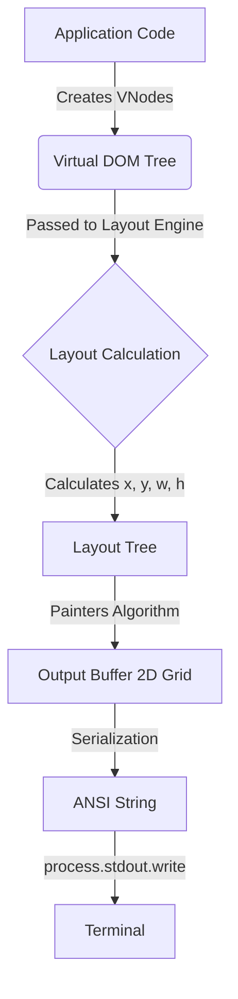

# Rendering Architecture

Understanding how **Tuiuiu** renders content will help you write more performant applications and debug layout issues.

## The Rendering Pipeline

The rendering process consists of three main phases:



### 1. Virtual DOM (VNodes)
When you call a component function (e.g., `Box(...)`), it returns a **Virtual Node (VNode)**. This is a lightweight JavaScript object describing *what* should be rendered.

```javascript
{
  type: 'box',
  props: { borderStyle: 'single', color: 'red' },
  children: [ ... ]
}
```

### 2. Layout Engine
Tuiuiu uses a simplified **Flexbox** implementation. It traverses the VNode tree:
1.  **Measure**: Calculates intrinsic sizes of text nodes.
2.  **Constraint**: Applies `width`, `height`, `maxWidth` constraints.
3.  **Distribute**: Allocates space based on `flexGrow` and `flexShrink`.
4.  **Align**: Positions children using `justifyContent` and `alignItems`.

The result is a **Layout Tree** where every node has absolute coordinates (`x`, `y`) and dimensions.

### 3. The Output Buffer (Painting)
The renderer creates a 2D grid of cells (`OutputBuffer`) representing the terminal screen. It paints nodes onto this grid in tree order (parents then children).

*   **Painters Algorithm**: Later nodes overwrite earlier nodes. This handles z-indexing naturally (child sits on top of parent background).
*   **Double Buffering**: Frames are fully constructed in memory before being flushed to the screen to prevent flickering.
*   **Clipping**: Content outside a box's bounds is clipped (hidden).

## Optimization Techniques

### Text Measurement Caching
Measuring string width (especially with ANSI codes and Unicode characters) is expensive. Tuiuiu caches these measurements.

### Updates & Batching
When a Signal changes:
1.  The effect bound to that signal triggers.
2.  Updates are **batched** via the `UpdateBatcher`.
3.  Multiple rapid signal changes result in a single re-render frame (throttled to ~60fps).

### Diffing (Incremental Rendering)
To minimize data sent over the wire (crucial for SSH sessions), Tuiuiu uses `log-update` principles:
1.  Compare the new frame string with the previous frame string.
2.  Move the cursor up/down to the changed lines.
3.  Overwrite only the changed lines.

## Coordinate System

- **Origin**: (0, 0) is the top-left corner of the render area.
- **X-axis**: Columns (characters).
- **Y-axis**: Rows (lines).

## Colors and Capabilities

The renderer queries `core/capabilities.ts` to determine:
- Should we use Unicode (`─`) or ASCII (`-`) borders?
- Should we use TrueColor (`#ff00ff`), 256-color, or 16-color ANSI codes?

This ensures your app looks its best on modern terminals (iTerm2, Kitty) while remaining usable on legacy ones (TTY).
