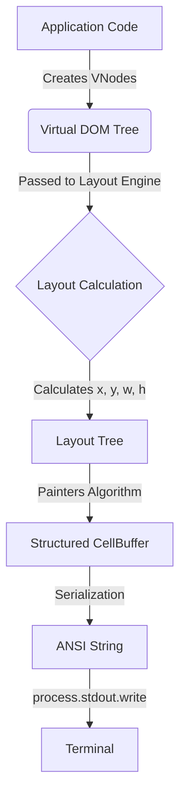
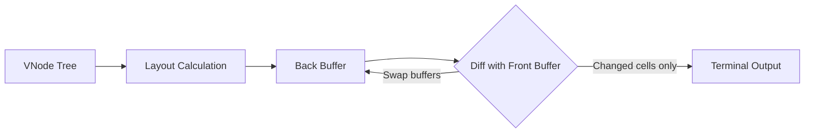

# Rendering Architecture

Understanding how **Tuiuiu** renders content will help you write more performant applications and debug layout issues.

## The Rendering Pipeline

The rendering process consists of three main phases:


```mermaid
graph TD
    A[Application Code] -->|Creates VNodes| B(Virtual DOM Tree)
    B -->|Passed to Layout Engine| C{Layout Calculation}
    C -->|Calculates x, y, w, h| D[Layout Tree]
    D -->|Painters Algorithm| E[Structured CellBuffer]
    E -->|Serialization| F[ANSI String]
    F -->|process.stdout.write| G[Terminal]
```

### 1. Virtual DOM (VNodes)
When you call a component function (e.g., `Box(...)`), it returns a **Virtual Node (VNode)**. This is a lightweight JavaScript object describing *what* should be rendered.

```javascript
{
  type: 'box',
  props: { borderStyle: 'single', color: 'red' },
  children: [ ... ]
}
```

### 2. Layout Engine
Tuiuiu uses a simplified **Flexbox** implementation. It traverses the VNode tree:
1.  **Measure**: Calculates intrinsic sizes of text nodes.
2.  **Constraint**: Applies `width`, `height`, `maxWidth` constraints.
3.  **Distribute**: Allocates space based on `flexGrow` and `flexShrink`.
4.  **Align**: Positions children using `justifyContent` and `alignItems`.

The result is a **Layout Tree** where every node has absolute coordinates (`x`, `y`) and dimensions.

### 3. The Cell Buffer (Painting)
The renderer creates a structured 2D grid (`CellBuffer`) representing the
terminal screen. Full-string and incremental rendering use the same rasterizer
and the same cells; only their serialization strategy differs.

*   **Painters Algorithm**: Later nodes overwrite earlier nodes. This handles z-indexing naturally (child sits on top of parent background).
*   **Double Buffering**: Frames are fully constructed in memory before being flushed to the screen to prevent flickering.
*   **Clipping**: Content outside a box's bounds is clipped (hidden).
*   **Wide-cell invariants**: Emoji and CJK glyphs own their complete footprint. Overwriting either half clears the other, so placeholders cannot become orphaned.

## Optimization Techniques

### Text Measurement Caching
Measuring string width (especially with ANSI codes and Unicode characters) is expensive. Tuiuiu caches these measurements.

### Conservative Subtree Layout Reuse
Above text measurement, the layout engine also reuses stable subtree layouts when the same `VNode` object is laid out under the same constraints.

That reuse is conservative on purpose:

- the cache key includes the current layout constraints
- layout-affecting props must still match
- direct child references must still match
- parent alignment adjustments clone the top-level layout node instead of mutating cached entries

This lets stable branches skip most of the flex/layout work while keeping invalidation safe when geometry changes.

### Draw Command Reuse
After layout, the frame pipeline also caches draw-command subtrees for stable `LayoutNode` branches.

That reuse is keyed conservatively by:

- the reused `LayoutNode` object
- the current accumulated offsets
- the inherited background color flowing into the subtree

When those inputs still match, the runtime can skip rebuilding the subtree command structure and, for a fully stable frame, even reuse the committed draw-command array directly.

### Updates & Batching
When a Signal changes:
1.  The effect bound to that signal is invalidated.
2.  The interactive scheduler coalesces burst invalidations into the latest pending rerun.
3.  Presentation is bounded by `maxFps` unless you explicitly remove that cap.
4.  If terminal output backpressure appears, stale intermediate flushes are dropped and the newest pending frame resumes after `drain`.

For game-like workloads, `render()` can also run a fixed-step logical update loop while keeping presentation independently capped.

### Delta Renderer (Default)

Tuiuiu uses a **cell-level delta renderer** by default for optimal performance:


```mermaid
graph LR
    A[VNode Tree] --> B[Layout Calculation]
    B --> C[Back Buffer]
    C --> D{Diff with Front Buffer}
    D -->|Changed cells only| E[Terminal Output]
    D -->|Swap buffers| C
```

**How it works:**
1.  **Double Buffering**: Maintains two cell buffers (front and back)
2.  **Cell-level Diffing**: Compares each cell (char, fg, bg, attrs) between buffers
3.  **Minimal Output**: Only writes ANSI sequences for changed cells
4.  **ANSI State Tracking**: Minimizes escape codes by tracking current terminal state
5.  **Wide-Glyph Reservation**: Characters that occupy multiple terminal cells reserve their full footprint so later writes do not drift visually

**Cell structure:**
```typescript
interface Cell {
  char: string;      // Character to display
  fg?: Color;        // Foreground color (hex, rgb, or named)
  bg?: Color;        // Background color
  attrs: CellAttrs;  // bold, dim, italic, underline, strikethrough, inverse
}
```

### Full-string Serializer

When `useDeltaRenderer: false`, Tuiuiu serializes the canonical `CellBuffer` as
a complete ANSI frame and uses line-oriented terminal updates:

1.  Compare the new frame string with the previous frame string.
2.  Move the cursor up/down to the changed lines.
3.  Overwrite only the changed lines.

Because both modes rasterize through the same cell path, ANSI sanitization,
theme resolution, wrapping, borders, reserved regions and grapheme handling
cannot drift between full and delta output.

Use `useDeltaRenderer: false` to enable this mode (useful for Static component support).

## Interactive Scheduling

The interactive render loop now adds another optimization layer above painting:

- first paint is immediate
- later reruns are scheduler-driven
- multiple same-turn invalidations collapse into one evaluation/paint of the latest state
- fixed-step logical updates can run faster than presentation
- output backpressure pauses terminal flushes without queuing every stale frame

See [Interactive Render Loop](/core/render-loop.md) for the runtime scheduler details.

## Coordinate System

- **Origin**: (0, 0) is the top-left corner of the render area.
- **X-axis**: Columns (characters).
- **Y-axis**: Rows (lines).

## Colors and Capabilities

The renderer queries `core/capabilities.ts` to determine:
- Should we use Unicode (`─`) or ASCII (`-`) borders?
- Should we use TrueColor (`#ff00ff`), 256-color, or 16-color ANSI codes?

This ensures your app looks its best on modern terminals (iTerm2, Kitty) while remaining usable on legacy ones (TTY).
