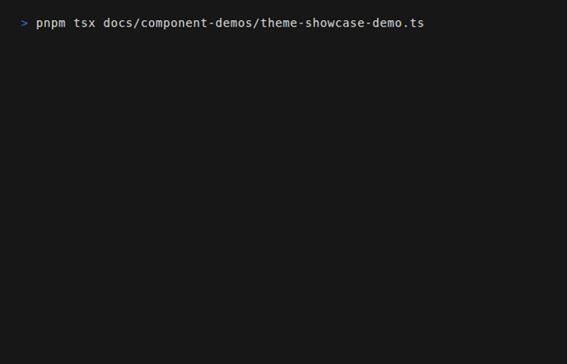

# Theming

Tuiuiu includes a robust theming system powered by **Signals**, allowing for instant, reactive theme switching without reloading the application.



## Quick Start

```typescript
import { useTheme, setTheme, themes, resolveColor } from 'tuiuiu.js';

// Get current theme
const theme = useTheme();

// Switch themes
setTheme(themes.dracula);

// Use semantic colors (recommended)
Text({ color: resolveColor('primary') }, 'Primary text');
Text({ color: resolveColor('success') }, 'Success text');
```

## Built-in Themes

Tuiuiu comes with **11 professionally designed themes**:

| Theme | Description | Mode |
|-------|-------------|------|
| `themes.dark` | Default dark mode (slate/blue) | Dark |
| `themes.light` | Clean light mode (white/blue) | Light |
| `themes.monokai` | Classic code editor theme (green accents) | Dark |
| `themes.dracula` | Popular purple-pink theme | Dark |
| `themes.nord` | Arctic-inspired blue palette | Dark |
| `themes['solarized-dark']` | Precision color scheme by Ethan Schoonover | Dark |
| `themes.gruvbox` | Retro groove with warm colors | Dark |
| `themes['tokyo-night']` | Inspired by Tokyo city lights | Dark |
| `themes.catppuccin` | Soothing pastel (Mocha variant) | Dark |
| `themes['high-contrast-dark']` | High contrast for accessibility | Dark |
| `themes.monochrome` | Grayscale only, no colors | Dark |

### Theme Color Palette

Each theme defines semantic colors that adapt automatically:

| Theme | Primary | Success | Warning | Error | Info |
|-------|---------|---------|---------|-------|------|
| **dark** | <span class="color-swatch" style="--swatch:#3B82F6" aria-label="#3B82F6"></span> `#3B82F6` | <span class="color-swatch" style="--swatch:#22C55E" aria-label="#22C55E"></span> `#22C55E` | <span class="color-swatch" style="--swatch:#F59E0B" aria-label="#F59E0B"></span> `#F59E0B` | <span class="color-swatch" style="--swatch:#EF4444" aria-label="#EF4444"></span> `#EF4444` | <span class="color-swatch" style="--swatch:#06B6D4" aria-label="#06B6D4"></span> `#06B6D4` |
| **light** | <span class="color-swatch" style="--swatch:#2563EB" aria-label="#2563EB"></span> `#2563EB` | <span class="color-swatch" style="--swatch:#16A34A" aria-label="#16A34A"></span> `#16A34A` | <span class="color-swatch" style="--swatch:#D97706" aria-label="#D97706"></span> `#D97706` | <span class="color-swatch" style="--swatch:#DC2626" aria-label="#DC2626"></span> `#DC2626` | <span class="color-swatch" style="--swatch:#0891B2" aria-label="#0891B2"></span> `#0891B2` |
| **dracula** | <span class="color-swatch" style="--swatch:#BD93F9" aria-label="#BD93F9"></span> `#BD93F9` | <span class="color-swatch" style="--swatch:#50FA7B" aria-label="#50FA7B"></span> `#50FA7B` | <span class="color-swatch" style="--swatch:#F1FA8C" aria-label="#F1FA8C"></span> `#F1FA8C` | <span class="color-swatch" style="--swatch:#FF5555" aria-label="#FF5555"></span> `#FF5555` | <span class="color-swatch" style="--swatch:#8BE9FD" aria-label="#8BE9FD"></span> `#8BE9FD` |
| **nord** | <span class="color-swatch" style="--swatch:#88C0D0" aria-label="#88C0D0"></span> `#88C0D0` | <span class="color-swatch" style="--swatch:#A3BE8C" aria-label="#A3BE8C"></span> `#A3BE8C` | <span class="color-swatch" style="--swatch:#EBCB8B" aria-label="#EBCB8B"></span> `#EBCB8B` | <span class="color-swatch" style="--swatch:#BF616A" aria-label="#BF616A"></span> `#BF616A` | <span class="color-swatch" style="--swatch:#81A1C1" aria-label="#81A1C1"></span> `#81A1C1` |
| **gruvbox** | <span class="color-swatch" style="--swatch:#83A598" aria-label="#83A598"></span> `#83A598` | <span class="color-swatch" style="--swatch:#B8BB26" aria-label="#B8BB26"></span> `#B8BB26` | <span class="color-swatch" style="--swatch:#FABD2F" aria-label="#FABD2F"></span> `#FABD2F` | <span class="color-swatch" style="--swatch:#FB4934" aria-label="#FB4934"></span> `#FB4934` | <span class="color-swatch" style="--swatch:#8EC07C" aria-label="#8EC07C"></span> `#8EC07C` |
| **tokyo-night** | <span class="color-swatch" style="--swatch:#7AA2F7" aria-label="#7AA2F7"></span> `#7AA2F7` | <span class="color-swatch" style="--swatch:#9ECE6A" aria-label="#9ECE6A"></span> `#9ECE6A` | <span class="color-swatch" style="--swatch:#E0AF68" aria-label="#E0AF68"></span> `#E0AF68` | <span class="color-swatch" style="--swatch:#F7768E" aria-label="#F7768E"></span> `#F7768E` | <span class="color-swatch" style="--swatch:#7DCFFF" aria-label="#7DCFFF"></span> `#7DCFFF` |
| **catppuccin** | <span class="color-swatch" style="--swatch:#CBA6F7" aria-label="#CBA6F7"></span> `#CBA6F7` | <span class="color-swatch" style="--swatch:#A6E3A1" aria-label="#A6E3A1"></span> `#A6E3A1` | <span class="color-swatch" style="--swatch:#F9E2AF" aria-label="#F9E2AF"></span> `#F9E2AF` | <span class="color-swatch" style="--swatch:#F38BA8" aria-label="#F38BA8"></span> `#F38BA8` | <span class="color-swatch" style="--swatch:#89DCEB" aria-label="#89DCEB"></span> `#89DCEB` |
| **monokai** | <span class="color-swatch" style="--swatch:#A6E22E" aria-label="#A6E22E"></span> `#A6E22E` | <span class="color-swatch" style="--swatch:#A6E22E" aria-label="#A6E22E"></span> `#A6E22E` | <span class="color-swatch" style="--swatch:#E6DB74" aria-label="#E6DB74"></span> `#E6DB74` | <span class="color-swatch" style="--swatch:#F92672" aria-label="#F92672"></span> `#F92672` | <span class="color-swatch" style="--swatch:#66D9EF" aria-label="#66D9EF"></span> `#66D9EF` |

### Switching Themes

```typescript
import { setTheme, themes, getNextTheme, useTheme } from 'tuiuiu.js';

// Switch to a specific theme
setTheme(themes.dracula);

// Cycle through themes
const currentTheme = useTheme();
const nextTheme = getNextTheme(currentTheme);
setTheme(nextTheme);

// Common pattern for Tab key cycling
useShortcut('tab', () => setTheme(getNextTheme(useTheme())));
```

## Semantic Colors

Use `resolveColor()` for theme-aware colors that automatically adapt:

```typescript
import { resolveColor } from 'tuiuiu.js';

// Semantic colors
Text({ color: resolveColor('primary') }, 'Primary color');
Text({ color: resolveColor('secondary') }, 'Secondary color');
Text({ color: resolveColor('success') }, 'Success/positive');
Text({ color: resolveColor('warning') }, 'Warning/caution');
Text({ color: resolveColor('error') }, 'Error/danger');
Text({ color: resolveColor('info') }, 'Informational');

// Auto-contrast foreground colors (for text on colored backgrounds)
Box(
  { backgroundColor: resolveColor('primary') },
  Text({ color: resolveColor('primaryForeground') }, 'Readable on primary!')
);

// Background hierarchy
Box({ backgroundColor: resolveColor('background') });  // Base background
Box({ backgroundColor: resolveColor('surface') });     // Card/panel surface
Box({ backgroundColor: resolveColor('muted') });       // Subtle background

// Foreground hierarchy
Text({ color: resolveColor('foreground') });           // Primary text
Text({ color: resolveColor('mutedForeground') });      // Secondary/muted text
```

### Auto-Contrast Foreground Colors

Semantic foreground colors automatically calculate the best contrast (white or black) based on the background luminance:

```typescript
// primaryForeground returns 'white' or 'black' based on primary color luminance
Box(
  { backgroundColor: resolveColor('primary') },
  Text({ color: resolveColor('primaryForeground') }, 'Always readable!')
);

// Works for all semantic colors
Text({ color: resolveColor('successForeground') });  // Auto-contrast on success bg
Text({ color: resolveColor('warningForeground') });  // Auto-contrast on warning bg
Text({ color: resolveColor('dangerForeground') });   // Auto-contrast on danger bg
Text({ color: resolveColor('infoForeground') });     // Auto-contrast on info bg
```

### Available Semantic Colors

| Color | Description |
|-------|-------------|
| `primary` | Primary brand color |
| `primaryForeground` | Auto-contrast text on primary |
| `secondary` | Secondary/accent color |
| `secondaryForeground` | Auto-contrast text on secondary |
| `success` | Positive/success state |
| `successForeground` | Auto-contrast text on success |
| `warning` | Warning/caution state |
| `warningForeground` | Auto-contrast text on warning |
| `error` / `danger` | Error/danger state |
| `dangerForeground` | Auto-contrast text on danger |
| `info` | Informational state |
| `infoForeground` | Auto-contrast text on info |
| `background` | Base background |
| `surface` | Elevated surface (cards) |
| `muted` | Subtle background |
| `foreground` | Primary text |
| `mutedForeground` | Secondary/muted text |
| `accent` | Accent highlight |
| `accentForeground` | Auto-contrast text on accent |

### Tailwind-Style Colors

You can also use Tailwind-style color names:

```typescript
Text({ color: resolveColor('blue-500') }, 'Blue');
Text({ color: resolveColor('red-600') }, 'Red');
Text({ color: resolveColor('green-400') }, 'Green');
```

## Theme Structure

Each theme defines a comprehensive structure:

### Palette (Color Scales)

Each semantic color has a scale from 50 (lightest) to 900 (darkest):

```typescript
const theme = useTheme();

// Access specific shades
theme.palette.primary[500];   // Base primary color
theme.palette.primary[300];   // Lighter shade
theme.palette.primary[700];   // Darker shade

theme.palette.success[500];   // Base success
theme.palette.danger[500];    // Base danger
theme.palette.neutral[500];   // Base neutral gray
```

### Background Hierarchy

```typescript
theme.background.lowest;   // Deepest background (app shell)
theme.background.base;     // Main application background
theme.background.subtle;   // Slightly elevated (sidebars)
theme.background.surface;  // Card/panel surface
theme.background.raised;   // Elevated surface (nested cards)
theme.background.elevated; // Floating elements
theme.background.popover;  // Popovers/dropdowns
theme.background.overlay;  // Modal overlay
```

### Foreground Hierarchy

```typescript
theme.foreground.primary;    // Highest contrast text
theme.foreground.secondary;  // Supporting content
theme.foreground.muted;      // De-emphasized content
theme.foreground.disabled;   // Inactive elements
theme.foreground.inverse;    // For colored backgrounds
```

### Accent Colors

```typescript
theme.accents.positive;   // Success (green)
theme.accents.warning;    // Caution (amber)
theme.accents.critical;   // Error (red)
theme.accents.info;       // Info (blue)
theme.accents.highlight;  // Selection highlight
```

### Component Tokens

Themes include pre-configured tokens for specific components:

```typescript
theme.components.button.primary.bg;
theme.components.button.primary.fg;
theme.components.panel.bg;
theme.components.tabs.tab.activeFg;
theme.components.modal.overlay;
theme.components.badge.success.bg;
```

## Creating Custom Themes

### Using `createTheme`

Extend an existing theme with overrides:

```typescript
import { createTheme, themes, setTheme } from 'tuiuiu.js';

const myTheme = createTheme(themes.dark, {
  name: 'my-custom',
  palette: {
    ...themes.dark.palette,
    primary: {
      ...themes.dark.palette.primary,
      500: '#8b5cf6',  // Custom purple primary
    },
  },
  accents: {
    ...themes.dark.accents,
    positive: '#10b981',  // Custom green
  },
});

setTheme(myTheme);
```

### Using `defineTheme`

Create a complete theme from scratch:

```typescript
import { defineTheme } from 'tuiuiu.js/themes';

const myTheme = defineTheme({
  name: 'my-theme',
  mode: 'dark',
  meta: {
    version: '1.0.0',
    author: 'Your Name',
    description: 'My custom theme',
  },
  palette: {
    primary: { /* 50-900 scale */ },
    secondary: { /* 50-900 scale */ },
    // ...
  },
  background: { /* hierarchy */ },
  foreground: { /* hierarchy */ },
  accents: { /* accent colors */ },
  states: { /* interactive states */ },
  borders: { /* border variants */ },
  opacity: { /* opacity values */ },
  components: { /* component tokens */ },
});
```

## Theme API Reference

### Core Functions

| Function | Description |
|----------|-------------|
| `useTheme()` | Get current theme (reactive) |
| `getTheme()` | Get current theme (non-reactive) |
| `setTheme(theme)` | Set the active theme |
| `pushTheme(theme)` | Push theme onto stack (temporary) |
| `popTheme()` | Pop theme from stack (restore previous) |
| `resolveColor(name)` | Resolve semantic color name to hex |
| `getNextTheme(current)` | Get next theme in cycle |
| `getPreviousTheme(current)` | Get previous theme in cycle |
| `createTheme(base, overrides)` | Create theme from base + overrides |
| `getContrastColor(bg)` | Get contrasting text color (white/black) |

### Theme Utilities

```typescript
import {
  themes,
  themeNames,
  getThemeByName,
  detectColorScheme,
  useSystemTheme,
} from 'tuiuiu.js';

// List all theme names
console.log(themeNames);
// ['dark', 'light', 'monokai', 'dracula', 'nord', ...]

// Get theme by name
const dracula = getThemeByName('dracula');

// Detect system preference
const scheme = detectColorScheme(); // 'dark' or 'light'

// Auto-set based on system preference
useSystemTheme();
```

## Border Radius

Themes can define border radius style affecting box characters:

```typescript
theme.borderRadius = 'none';  // ┌ ┐ └ ┘
theme.borderRadius = 'sm';    // ┌ ┐ └ ┘
theme.borderRadius = 'md';    // ╭ ╮ ╰ ╯
theme.borderRadius = 'lg';    // ╭ ╮ ╰ ╯
```

## System Theme Detection

Detect and use the system's preferred color scheme:

```typescript
import { useSystemTheme, detectColorScheme } from 'tuiuiu.js';

// Detect preference
const preference = detectColorScheme(); // 'dark' or 'light'

// Automatically set matching theme
useSystemTheme();
```

## Best Practices

1. **Use semantic colors**: Prefer `resolveColor('primary')` over hardcoded hex values
2. **Use auto-contrast**: Use `primaryForeground` for text on primary backgrounds
3. **Respect hierarchy**: Use background levels for proper layering
4. **Test across themes**: Ensure your UI works with all built-in themes
5. **Cycle themes for testing**: Use Tab key cycling during development

```typescript
// Development pattern for theme testing
useShortcut('tab', () => setTheme(getNextTheme(useTheme())));
```

The `resolveColor` function supports:
- All semantic colors with auto-contrast
- Tailwind-style color names (`blue-500`, `red-600`)
- Theme palette access
- Background/foreground hierarchy
